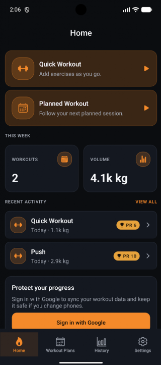
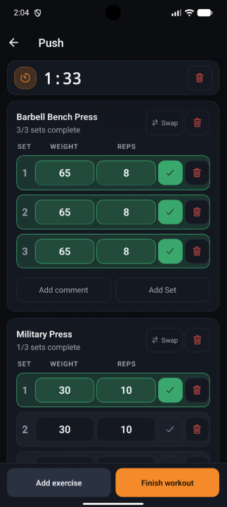
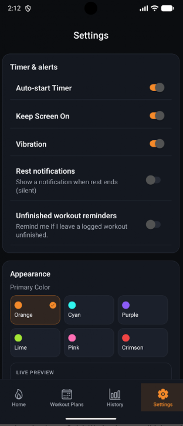
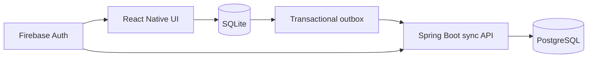

# TrainFrame

TrainFrame is an offline-first workout tracker for planning workouts, logging strength and cardio sessions, reusing completed workouts, and reviewing training history.

**Available for Android on Google Play. iOS is not released yet.**

<p align="center">
  <a href="https://play.google.com/store/apps/details?id=com.mehka.gymappmvp">
    
  </a>
</p>

<p align="center">
  <a href="https://github.com/mehiskork/gym-app-mvp/actions/workflows/ci-fast.yml"></a>
  <a href="https://github.com/mehiskork/gym-app-mvp/actions/workflows/backend-integration.yml"></a>
</p>

TrainFrame is a solo full-stack production portfolio project designed and built by Mehis Kork.

## Product preview

<table>
  <tr>
    <td align="center">
      <br>
      <sub><strong>Home</strong> — quick starts, planned training, and recent progress</sub>
    </td>
    <td align="center">
      <br>
      <sub><strong>Active workout</strong> — focused set logging with an integrated timer</sub>
    </td>
  </tr>
  <tr>
    <td align="center" colspan="2">
      <br>
      <sub><strong>Settings</strong> — timer behavior, reminders, and appearance</sub>
    </td>
  </tr>
</table>

## Key features

### Workout logging

- Start an ad-hoc Quick Workout or follow a Planned Workout.
- Log strength sets, reps, weight, rest time, completion, and notes.
- Track cardio-specific duration, distance, pace, speed, incline, resistance, and related metrics.
- Resume or discard an active workout, substitute exercises for the current session, and enable unfinished-workout reminders.

### Planning and reuse

- Create and edit workout plans, sessions, exercises, targets, and plan notes.
- Browse and import ready-made Templates.
- Favorite exercises and prefill planned sessions from previously completed values.
- Reuse a completed workout as a new Quick Workout, a new plan, or a session in an existing plan.

### Progress and history

- Review completed workouts and detailed session results.
- Track personal records and weekly workout and volume summaries.
- Export workout history as CSV.

### Offline and account sync

- Use core workout features offline with SQLite as the on-device data store.
- Start in guest mode, then sign in with Google and migrate guest data to the account.
- Synchronize across devices and restore account data on a fresh device.
- Delete the account and its synchronized data from the app.

## Technical highlights

- SQLite-first mobile architecture keeps workout logging available without a network connection.
- Domain writes and transactional outbox operations commit together before asynchronous synchronization.
- A Spring Boot and PostgreSQL backend authenticates requests, resolves cross-device conflicts, and restores synchronized state.
- Firebase provides the Google authentication boundary; application data remains in SQLite and PostgreSQL.
- Guest-to-account migration preserves existing account data while moving device-owned guest data into the authenticated account.
- Completed-session integrity and account lifecycle safeguards are enforced across mobile and backend boundaries.
- Flyway migrations, Jest, JUnit, Testcontainers, Docker Compose, Railway, and EAS Build support development through production delivery.

## Architecture

The React Native UI reads and writes SQLite first. Each synchronized local change is added to an outbox in the same transaction, then sent asynchronously to the Spring Boot sync API. The backend coordinates cross-device state in PostgreSQL, while Firebase authenticates account requests rather than storing application data.



See the [architecture overview](docs/architecture.md), [sync protocol](docs/sync-protocol.md), and [conflict rules](docs/conflicts.md) for implementation details.

## Technology stack

| Area | Technology |
| --- | --- |
| Mobile | Expo, React Native, TypeScript, React Navigation, SQLite |
| Backend | Java 25, Spring Boot, Spring Security |
| Data | PostgreSQL, Flyway |
| Authentication | Firebase Authentication, Google Sign-In |
| Testing | Jest, JUnit, Testcontainers |
| Delivery | Docker Compose, EAS Build, Railway |

## Repository structure

```text
apps/
  mobile/       Expo React Native application
  backend/      Spring Boot synchronization API
docs/           Architecture, product rules, setup, and release documentation
```

## Run locally

Prerequisites: Node.js 24, Java 25, Docker with Compose, and a TrainFrame Expo development build for native mobile testing.

Start PostgreSQL and the backend from the repository root:

```bash
docker compose up --build
```

Install the locked mobile dependencies and start Metro:

```bash
cd apps/mobile
npm ci --include=dev
npm run start
```

Expo Go is not supported because TrainFrame uses custom native modules, including native Google Sign-In. See [Local Development](docs/local-development.md) for development-build setup, Firebase requirements, networking, and troubleshooting.

## Tests and CI

The [fast CI workflow](.github/workflows/ci-fast.yml) runs on pushes and pull requests:

- mobile dependency installation, ESLint, TypeScript typecheck, and Jest;
- backend unit tests with Java 25.

The [backend integration workflow](.github/workflows/backend-integration.yml) runs `./mvnw verify` with Docker and Testcontainers for backend-relevant pull requests, pushes to `main`, and manual dispatches. EAS Build handles mobile development, preview, and production builds; it is not a GitHub Actions test check.

Local validation commands are documented in [Local Development](docs/local-development.md).

## Documentation

| Document | Purpose |
| --- | --- |
| [Local Development](docs/local-development.md) | Local setup, native development builds, networking, and testing |
| [Architecture](docs/architecture.md) | System design and data flow |
| [Sync Protocol](docs/sync-protocol.md) | Offline synchronization protocol |
| [Product Rules](docs/product-rules.md) | Product behavior and invariants |
| [Conflict Rules](docs/conflicts.md) | Conflict resolution and completed-session rules |
| [Android Release](docs/android-release.md) | Android and EAS release process |

## Platform status

- **Android:** available in production on [Google Play](https://play.google.com/store/apps/details?id=com.mehka.gymappmvp)
- **iOS:** not released

## License

Copyright © 2026 Mehis Kork. All rights reserved. See [LICENSE](LICENSE).
